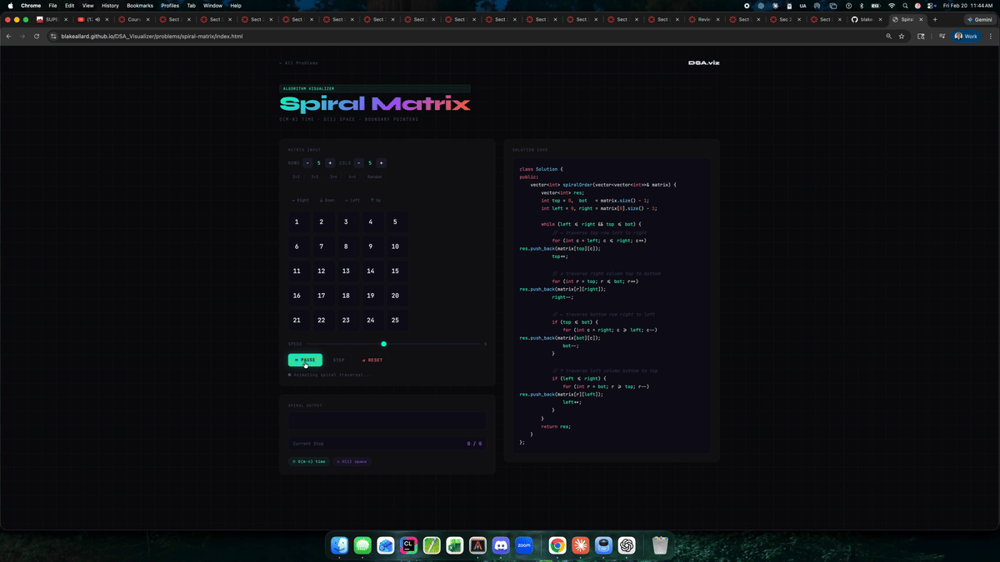

# DSA Visualizer

Interactive algorithm visualizations built to strengthen deep understanding of data structures and problem-solving patterns.

Live Demo:
https://blakeallard.github.io/DSA_Visualizer/

---

## Preview

Place your GIF at: DSA_Visualizer/assets/demo.gif

---

## Overview

This project converts common interview-style problems into interactive visual simulations.

Instead of only writing C++ solutions, each algorithm is reconstructed visually to expose:

- Traversal mechanics
- Pointer movement
- State transitions
- Heap restructuring
- Matrix boundary contraction
- Binary search flow

The goal is not just correctness — it is algorithmic intuition.

---

## Tech Stack

- HTML
- CSS
- Vanilla JavaScript
- GitHub Pages

No frameworks. No build tools. No dependencies.

Fully static deployment.

---

## Current Problems

- Spiral Matrix — Matrix traversal pattern
- Search 2D Matrix — Binary search over matrix
- Heap Insert — Heap restructuring logic

More problems will be added as I progress through advanced algorithm patterns.

---

## Project Structure

DSA_Visualizer/
├── index.html
├── README.md
└── problems/
    ├── spiral-matrix/
    ├── search-2d-matrix/
    ├── heap-insert/
└── assets/
    └── demo.gif

Each problem is fully self-contained inside its own directory.

---

## Deployment

This site is automatically deployed using GitHub Pages from the main branch.

To update the live site:

git add .
git commit -m "Update visualizer"
git push

Changes deploy automatically.

---

## Run Locally

Open index.html directly in your browser.

Or run:

npx serve .
